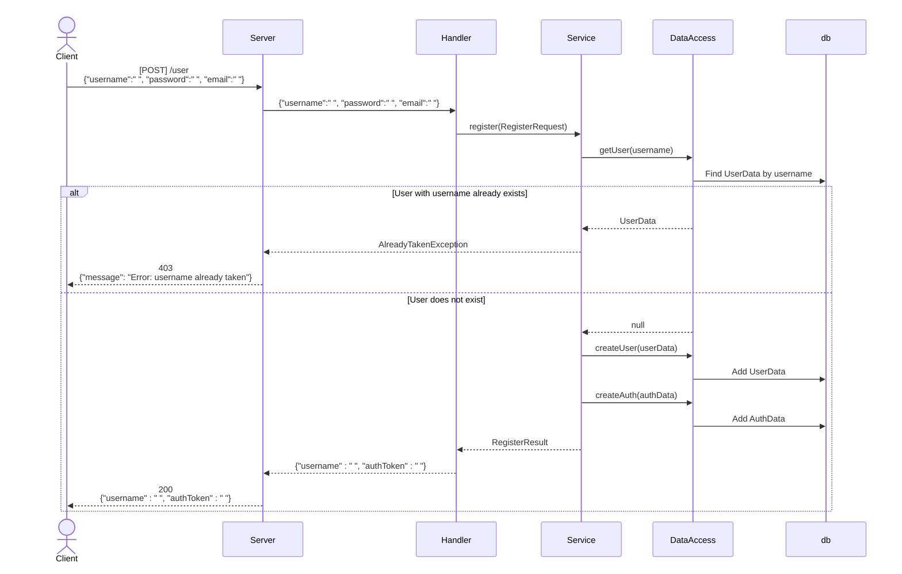

# My Project Notes

```mermaid
sequenceDiagram
    actor Client
    participant Server
    participant Handler
    participant Service
    participant DataAccess
    box db
    end

    Client->>Server: [POST] /user<br/>{"username":" ", "password":" ", "email":" "}
    Server->>Handler: {"username":" ", "password":" ", "email":" "}
    Handler->>Service: register(RegisterRequest)
    Service->>DataAccess: getUser(username)
    DataAccess->>db: Find UserData by username
    
    alt User with username already exists
        DataAccess-->>Service: UserData
        Service-->>Server: AlreadyTakenException
        Server-->>Client: 403<br/>{"message": "Error: username already taken"}
    else User does not exist
        DataAccess-->>Service: null
        Service->>DataAccess: createUser(userData)
        DataAccess->>db: Add UserData
        Service->>DataAccess: createAuth(authData)
        DataAccess->>db: Add AuthData
        Service-->>Handler: RegisterResult
        Handler-->>Server: {"username" : " ", "authToken" : " "}
        Server-->>Client: 200<br/>{"username" : " ", "authToken" : " "}
    end
```

